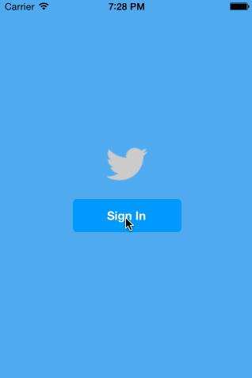
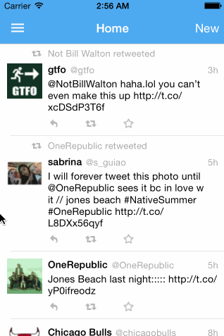

Twitter
=

A simple iOS 7 Twitter client. It allows you to view your home timeline (with infinite scrolling), compose new tweets, view/reply to existing tweets, and view user profiles.

Time spent on project 3: ~10 hours
Time spent on project 4: ~8 hours

Completed user stories
-

#### Project 3
 * [x] Required: User can sign in using OAuth login flow
 * [x] Required: User can view last 20 tweets from their home timeline
 * [x] Required: The current signed in user will be persisted across restarts
 * [x] Required: In the home timeline, user can view tweet with the user profile picture, username, tweet text, and timestamp.
 * [x] Required: User can pull to refresh
 * [x] Required: User can compose a new tweet by tapping on a compose button.
 * [x] Required: User can tap on a tweet to view it, with controls to retweet, favorite, and reply.
 * [x] Optional: When composing, you should have a countdown in the upper right for the tweet limit.
 * [x] Optional: After creating a new tweet, a user should be able to view it in the timeline immediately without refetching the timeline from the network.
 * [x] Optional: When composing, you should have a countdown in the upper right for the tweet limit.
 * [x] Optional: Replies should be prefixed with the username and the reply_id should be set when posting the tweet.
 * [x] Optional: User can load more tweets once they reach the bottom of the feed using infinite loading similar to the actual Twitter client.

#### Project 4
Hamburger menu:
 * [x] Required: Dragging anywhere in the view should reveal the menu.
 * [x] Required: The menu should include links to your profile, the home timeline, and the mentions view.

Profile page:
 * [x] Required: Contains the user header view
 * [x] Required: Contains a section with the users basic stats: # tweets, # following, # followers
 * [x] Optional: Pulling down the profile page should blur and resize the header image.

Home timeline:
 * [x] Required: Tapping on a user image should bring up that user's profile page

Notes
-

#### Project 3
- I didn't handle network errors but tried to put in TODOs explaining what I would have done.
- I implemented a separate function for different types of home timeline API requests (initial load, refreshing the top of the list, and loading more at the bottom). I'm not sure if having a single function that takes in params would have been preferable.
- Some of my client methods got pretty ugly with lots of nesting. Is that generally expected or is it standard to separate out some of the inner stuff into separate functions?

#### Project 4
- I wanted to reuse the table view of tweets from the timeline view controllers in the profile view controller, but I couldn't figure out how to do it cleanly so I ended up duplicating lots of code.
- The slideout stuff became pretty complicated with all the delegates. I'm guessing there's no simpler way to do it?

CocoaPods
-

- AFNetworking (for API requests and image loading)
- BDBOAuth1Manager (for authentication)
- Mantle (for model classes)
- MBProgressHUD (for loading spinner)
- DateTools (for date formatting)
- SVPullToRefresh (for pull to refresh and infinite scroll)

Walkthroughs
-

#### Project 3

#### Project 4

